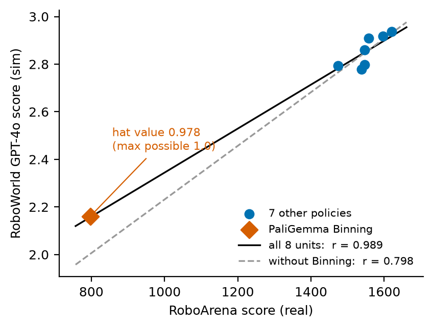
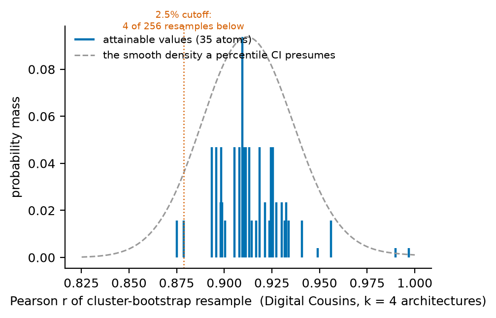
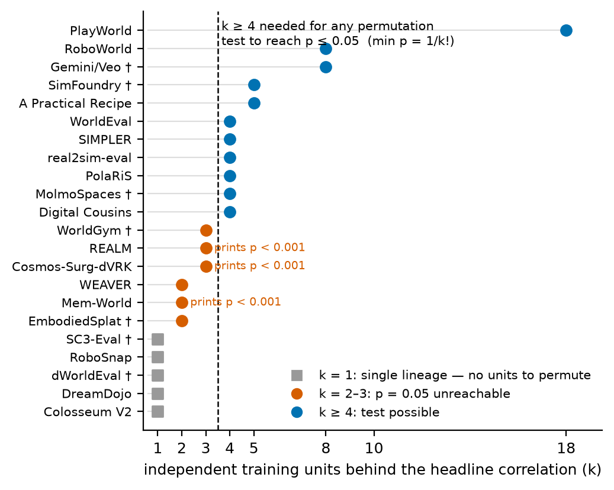

# What Does a Sim-to-Real Correlation Support? Five One-Line Checks and a Twenty-Two-Paper Audit

*Tri Lam (tri@maydow.com) · Draft v1.1 · 2026-07-21*

---

## Abstract

Real-to-sim policy evaluation reports its central claim as a correlation between simulated and
real-world policy success rates. We survey the twenty-two papers reporting such a correlation and find
that the field's central number rests on almost no independent data. Twenty-one of twenty-two compute
their headline correlation over fewer than ten independent training units; five compute it over
checkpoints, finetunes, or test conditions of a single policy (one unit); five report any uncertainty on it. Three print
*p* < 0.001, parametric values computed over pooled, non-independent points, where their own unit
counts (*k* = 3, and in one case *k* = 2) cap any permutation test over units at *p* = 0.167 or 0.5.
These are combinatorial ceilings,
not data-availability problems: they would hold if every paper released everything tomorrow.

We propose five checks that should accompany any such correlation, each costing a line of
arithmetic on data the authors already have, and we ship them as a tool. Two of the five need only the
number of independent units, recoverable from every paper's own setup description (§8.1 states the
coding rules where it is ambiguous). Justifying the rest against data recovered from published
figures, we find the conventional signals rank results in exactly the wrong order. One of the survey's
largest designs (RoboWorld, *r* = 0.989, *p* < 0.001) drops to 0.798 when one of its eight
policies is removed, and the *p*-value neither warns nor helps (its rank correlation survives the same
removal; §4 reports both); a paper with half the units and no *p*-value (Digital Cousins) is stable to
every removal. That contrast is the good news: the checks separate results that survive scrutiny from
results that do not, and they clear more often than they flag. An unstated checkpoint-selection choice
flips one published correlation from +0.90 to
−0.31; the ranking metric reported alongside *r* is roughly three to fifteen times less stable than *r*
itself; one published value of that metric is not attainable at the sample size its own paper states.
The same checks, applied to our own pipeline, caught two silently dropped preregistration
requirements (§9).

None of this requires new experiments. Five papers already report some uncertainty at these sample
sizes. What we are asking for is
one parenthetical in a results table:

> *r* = 0.989 (*k* = 8 policies; drop-one range 0.798–0.994; Fisher-z [0.937, 0.998])

We release the tool, the recovered data, the analysis, and its preregistration.

---

## 1. The setting

Testing a robot policy on hardware is slow and expensive. So the field builds simulators and asks
whether policy *ranking* in simulation matches ranking in reality. The answer is reported as a Pearson
correlation, and high values are read as license to substitute simulation for hardware.

The design underneath is small. Each correlation is typically computed over a handful of policies,
sometimes over multiple training checkpoints of the *same* policy, which are not independent samples.
Each point's success rate is a binomial proportion over 16–40 real episodes.

This is not a criticism of any author: real-robot episodes are genuinely expensive. It does mean the
published number carries less information than three decimal places imply. We quantify how much less.

Two findings need stating before any method, because they require no extraction and no judgment
call, only counting against each paper's own setup description. Five of the twenty-two surveyed
papers compute their headline correlation over checkpoints or finetunes of a single policy: one
independent unit. Three papers print *p* < 0.001 for correlations whose unit counts cap any
permutation test over units at *p* = 0.167 or, at *k* = 2, 0.5. The printed values are parametric tests over pooled,
non-independent points. Nothing was miscalculated; the convention answers a different question
from the one the number appears to answer (§8).

The rest of the findings required recovering data from published figures. What checking each named
number revealed (MMRV, defined in §7, is the field's ranking metric: how badly sim mis-ranks the
policies, weighted by how much the mistake matters):

| published number | what checking revealed |
|---|---|
| RoboWorld *r* = 0.989, *p* < 0.001 | 0.798 after removing one of eight policies; the *p*-value does not warn (§4) |
| real2sim-eval rope *r* = +0.90 | **−0.31** under an equally defensible checkpoint-selection rule, which the paper does not state (§5) |
| real2sim-eval T-block MMRV = 0.108 | misses the lattice at the only printed checkpoint count (an appendix count stated for a different experiment); lands on it at the count our extraction recovers (§7.1) |
| real2sim-eval Table I MMRVs | reproduce to print precision — but only under the reverse of the metric's defining argument order, identifiable solely by brute-forcing conventions against two figures at once (§7.2) |
| SimFoundry MMRV = 0.018 | our own first verdict against it, withdrawn: the granularity test passes arbitrary values 52.5% of the time there, and is inapplicable to a mean over per-task lattices (§7.1) |
| MolmoSpaces pick ρ = 0.98 | appears nowhere in its figures, which print 1.00; our extraction confirms perfectly concordant ranks (§8.1) |
| REALM V-VIEW *r* = 0.89, MMRV = 0.253 | the *r* reproduces from the panel's 14 plotted points to 0.0002; the MMRV cannot — likely computed over the 7 design-implied points the panel leaves undrawn, which no reader can recover (§7.2) |

The last row is deliberate. This paper applies its own checks to itself, and they fired: a
granularity verdict withdrawn after computing its false-pass rate, survey counts corrected in both
directions on source verification (§8.0), a preregistered pipeline that silently dropped two of its
own requirements (§9). We publish the corrections rather than the clean version because the failure
mode we describe, a stated procedure that quietly does not match what was computed, does not spare
the people writing about it.

---

## 1.1 Related work

Two audit traditions come before this paper; neither asks our question.

**Instrumentation audits in RL and robotics.** *Deep Reinforcement Learning that Matters*
(arXiv:1709.06560) showed that reported RL gains often failed to survive changes in seed, environment,
or codebase. *Deep RL at the Edge of the Statistical Precipice* (arXiv:2108.13264) showed that
point-estimate comparisons at small run counts are unreliable and shipped `rliable` to fix it. Both
established the pattern we follow: an instrumentation paper earns its place by re-adjudicating named
numbers and shipping a tool.

**The closest work, and the gap it leaves.** *What Are We Actually Benchmarking in Robot Manipulation?*
(arXiv:2606.04233) audits four failure modes in manipulation benchmarks: shortcut solvability, lack of
statistical significance, creeping overfitting, and data-source dependence. Using paired
task-stratified Wald tests it finds that only 19.8% of LIBERO and 19.7% of SimplerEnv SOTA claims are
provably significant, and that a probe with no language encoder scores at or near reported SOTA.

It also identifies, independently and in stronger language than we do, the selection problem of our §5:

> *"The score we report is the best of several checkpoints, each scored on the reported suite… Keeping
> the checkpoint that scores best on it is therefore selection on the test set."*

They apply that critique to their own probe and make the practice visible. Our §5 shows the same choice
flips the sign of a published correlation on one task, and that no surveyed paper states which rule it
used.

**The gap it leaves is the space this paper occupies.** That audit contains no mention of
*correlation*, *real-to-sim*, *real2sim*, or *sim-to-real*. It asks whether a benchmark *score*
supports the claim that policy A beats policy B. We ask whether a *sim-real correlation* supports the
claim that the simulator can stand in for hardware at all. Two routes reaching the same place is
stronger evidence than either alone.

**What neither line covers.** Both that audit and `rliable` analyze data the benchmarks publish. The
papers we examine publish no machine-readable results at all (§3), so the prior question, *can this
number be checked by anyone?*, has not been asked in this setting.

**The statistics are a century old, and we claim no novelty in them.** Drop-one is a case-deletion
influence diagnostic (Cook 1977; Belsley, Kuh & Welsch 1980). The interval is Fisher's small-sample
*z* (Fisher 1915; 1921). The permutation floor is the discreteness of the randomization test (Fisher
1935; Pitman 1937), and the bootstrap ceiling is elementary counting over resamples (Efron 1979).
Computing significance over pooled dependent points is pseudoreplication (Hurlbert 1984), which
shrinks the effective sample by the design effect (Kish 1965); §13(b)'s attenuation logic goes back
to Spearman (1904), with its modern small-sample complication in Loken and Gelman (2017). The
contribution is the audit: recovering the data these classical tools need from a literature that
does not release it, and reporting what they show.


---

## 2. What to report

Five checks. Each is arithmetic on data the authors already have, and each is included because it
catches something the conventional reporting in this literature misses.

| check | question it answers | when it fires |
|---|---|---|
| **Leverage** | Is one unit carrying the correlation? | max drop-one \|Δ*r*\| > 0.10 |
| **Fisher-z** | What can this many independent units support? | always — report the interval |
| **Exact permutation** | Is a test at α = 0.05 even possible? | *k* ≤ 3, where min *p* = 1/*k*! > 0.05 |
| **Bootstrap support** | Is a percentile CI meaningful? | C(2*k*−1, *k*) < 50 attainable values |
| **Granularity** | Is your own reported value attainable at your stated design? | value is not a multiple of 1/(*N*·*n*) |

The first matters most, and nothing in current practice provides it.

*(The 1/k! minimum is for a one-sided test. A two-sided test can require up to 2/k! (0.083 at k = 4),
but only when some permutation attains the observed |r| with the opposite sign. On the Digital Cousins
data none comes close: all 24 block permutations give positive r, the largest competitor is 0.871, and
the attained two-sided p is 1/24 = 0.0417. §8's k ≤ 3 verdicts only strengthen under a two-sided
reading.)*

### 2.1 The same tool, two published papers, opposite verdicts

The tool's output on both, verbatim:

```
RoboWorld, Fig. 9a (GPT-4o score)
  8 points over 8 independent units
  r = +0.9888   reported 0.989

  leverage        max drop-one |Δr| = 0.191  [0.798, 0.994]   ONE UNIT CARRIES THIS RESULT
  Fisher-z 95%    [+0.937, +0.998]   (df = k−3 = 5)
  exact perm.     min attainable p = 1/8! = 0.0000   test at .05 possible
  bootstrap       ≤ C(15,8) = 6435 distinct values   usable

  → Report the drop-one range 0.798–0.994 alongside r; one unit moves it by 0.191. Check the rank correlation too — leverage on Pearson need not affect ranking.
```

```
Digital Cousins (unit = architecture)
  16 points over 4 independent units
  r = +0.9094   reported 0.91

  leverage        max drop-one |Δr| = 0.013  [0.905, 0.922]   no single unit dominates
  Fisher-z 95%    [-0.410, +0.998]   (df = k−3 = 1)
  exact perm.     min attainable p = 1/4! = 0.0417   test at .05 possible
  bootstrap       ≤ C(7,4) = 35 distinct values   too coarse for a percentile CI

  → Do not report a bootstrap CI: only 35 distinct values are attainable at k=4.
```

RoboWorld has the larger sample and a *p*-value. Digital Cousins has neither, and half the
independent units. The conventional signals rank them in exactly the wrong order.

Two things are worth reading off these outputs. A high *r* with a small *p* can still rest on one
point: RoboWorld's *p* < 0.001 is correct and says nothing about the drop-one range. And Digital
Cousins' *r* is stable to unit composition, yet its k-unit interval is wide: Fisher-z (the textbook
way to put an interval on a correlation) spans [−0.410, +0.998] because *k* = 4 genuinely supports
little.

### 2.2 The choice the checks depend on

Every check needs to know what an independent unit is, and that is where the literature is silent.

Successive checkpoints of one training run are not independent samples. Neither are task-policy cells
sharing a policy. No paper in our survey states which it treats as its unit, and the choice moves
the numbers substantially: on Digital Cousins, dropping a *generalization level* moves *r* four times
more than dropping an *architecture* (§4.1).

Our rule, applied throughout: **the training run is the unit; a checkpoint is not.** A reader who
prefers a different rule can recompute from the released data, which is more than the surveyed papers
permit.

**Choosing a unit when you have tasks *and* policies *and* seeds.** Evaluation data is usually crossed,
not nested, so there is no single right answer. But there is a rule that decides it:

> **Resample the axis your claim generalizes over.**

If the claim is *"this simulator predicts how a **new policy** will do"*, the unit is the policy, and a
policy's task cells travel together. If the claim is *"this simulator is accurate across **tasks**"*, the
unit is the task. If you are claiming both, report both: on Digital Cousins the two give 1.9% and 8.1%
(§4.1), and a reader deserves to see the larger one.

Seeds, where they exist, are the cleanest unit available and should be preferred over either. Almost no
paper in this literature has them.

### 2.3 Cost

`correlation_audit.py`, ~280 lines, `numpy` and `scipy` only. Runs in milliseconds on any of these
datasets. The inputs are the scatter points and one unit label per point, quantities every author
already has and none currently reports.

---

## 3. Recovering the data

No paper we surveyed publishes machine-readable evaluation results. (Throughout, the **subject
paper** is real2sim-eval, arXiv:2511.04665, the paper whose data we recover and re-analyze most
deeply.) We checked paper text, project sites, and repositories: SimplerEnv (1,126★) and PolaRiS (221★, both as of 2026-07-20) ship simulation environments and code
but no result files; REALM's paper promises *"full non-aggregated results… on the project
website"*, which links a repository containing 59 YAML files (58 configuration, one CI workflow) and
no results. Across every source tree there is not one CSV or
JSON of results.

So we recover coordinates from the published figures. Many are vector artwork, so the plotted values
are exact drawing commands rather than pixel estimates, and the arXiv e-print tarballs often contain
original vector figures even where the compiled PDF rasterizes them.

**Recoverability: 8 of 12 papers attempted.** The remainder failed for reasons no effort fixes: three
have raster figures (verified in their e-print sources: two ship PNGs, one wraps a raster inside a PDF
container), one has no scatter plot. Of the ten papers added to the survey after this pass (six found
during earlier drafting, four via the completeness searches of §8.1), three (Cosmos-Surg-dVRK, DreamDojo,
MolmoSpaces) ship vector scatter figures that we extracted and validated against their printed
statistics (§4.2 reports their leverage results), bringing the recovered set to eleven of
twenty-two. REALM, one of the original eight, was also re-extracted point-by-point across all four of
its panels (`data/realm.csv`). EmbodiedSplat and Mem-World ship raster figures only. ⚠️ *Our first five attempts were hand-picked as likely to
succeed and returned 4/5; the unselected remainder returned 3/6; the subject paper's own figure,
extracted before either pass, is the twelfth attempt and eighth success. We report the pooled 67%
(8/12), not the selected 80%.* Pooled over all seventeen attempts to date (the original twelve plus
five papers attempted as the survey grew), recoverability is 11/17 (65%).

**Validation.** Every dataset used here reproduces a statistic its authors published (in seven cases
an *r* printed inside the figure itself) to ≤0.0006 (Digital Cousins' figure prints the rounded 0.91; our
0.9094 additionally matches that paper's numeric tables exactly). Several also land exactly on the *k/n*
lattice implied by the stated trial count (a success rate over *n* trials can only be a multiple of
1/*n*).

### 3.1 What an extraction can and cannot be validated against

We validated every recovered dataset by reproducing a statistic its authors published, and that licenses
less than it appears to. Pearson *r* averages over point-identity errors; a maximum-type statistic does
not. Two cases taught us this: one where a published figure's plotted positions deviate from the same
paper's own numeric table, and one where our own *r*-validated data failed to reproduce the same
paper's MMRV.

> **An extraction must be validated against a statistic with the same conditioning as the one you intend
> to compute.** An *r*-based validation licenses *r*-based claims and nothing else.

Every *r*-based finding in this paper is covered by that validation. Appendix A records both cases
in full, including the resolution of the MMRV mismatch.

*(A validation stronger than reproducing one statistic is occasionally available: on the subject
paper's Figure 9 our extracted whiskers match exact 95% Clopper–Pearson intervals to <10⁻⁵ on all 208
bounds, which recovers the episode counts themselves from the figure geometry alone: sim *n* = 200,
real *n* = 20/27/16 per task.)*

*We also bounded the extraction error itself with a fully independent method: a pixel-level
re-extraction of RoboWorld Fig. 9a (300 dpi render, legend-sampled color-blob detection,
gridline-based calibration; `pixel_reextract.py`, released) reproduced all eight points to within 0.61
x-units and 0.0013 y-units (the worst case an occluded marker), changing r by 0.0001 and the
drop-one range not at all. Occlusion, not calibration or anti-aliasing, is the dominant pixel-method
error source; the vector method resolves occluded and exactly coincident markers that pixel methods
cannot.*

---

## 4. Why the leverage check: one policy can carry a correlation

This is the evidence for §2's **leverage** check, which asks how much one data point moves the
answer. Removing one independent unit at a time from RoboWorld, one of the survey's largest designs (*k* = 8 policies, reported *p* < 0.001):

| panel | published *r* | drop-one range | range width | **max \|Δ*r*\| from *r*** | most influential unit |
|---|---|---|---|---|---|
| 9a GPT-4o score | 0.989 | [0.798, 0.994] | 0.196 | **0.191** | PaliGemma Binning |
| 9b Gemini score | 0.944 | [0.778, 0.969] | 0.190 | **0.165** | PaliGemma Binning |
| 10a GPT-4o success rate | 0.901 | [0.836, 0.975] | 0.139 | **0.075** | **Pi0.5** — *not* the isolated point |
| 10b Gemini success rate | 0.876 | [0.708, 0.971] | 0.263 | **0.169** | PaliGemma Binning |

The range width and the max |Δ*r*| are two different statistics, and an earlier draft of this table
conflated them. The *range width* is the gap between two different removals; the max |Δ*r*| is how far
a single removal moves the published value, and it is the quantity §2.1 reports and the tool computes.
They nearly coincide on 9a (0.196 vs 0.191), which is what hid the difference. On 10a they do not: no
policy moves *r* by 0.139; the largest single effect is 0.075.

**On two of four panels, one policy carries the correlation.** Removing PaliGemma Binning takes 9a's
*r* from 0.989 to 0.798, while the other seven removals move it by at most 0.005, a 38× ratio. The
same holds on 9b (0.165 vs 0.025). That policy sits at *x* = 797 against a cluster spanning 1474–1621.



**Figure 1.** RoboWorld Fig. 9a, re-plotted from our extracted data. Removing PaliGemma Binning
(diamond, hat value 0.978 of a maximum 1.0) moves *r* from 0.989 to 0.798; the other seven removals
move it by at most 0.005. Nothing conventionally reported, neither *p* < 0.001 nor the Fisher-z
interval, distinguishes the solid fit from the dashed one. Regenerated by `figures/make_figures.py`
from `data/roboworld.csv`.

⚠️ **It does not hold on the other two panels, and the exception is instructive.** On 10a the most
influential policy is Pi0.5 (0.075), not the isolated point (0.065), so the geometric story in §4.1
is a tendency, not a law. On 10b Binning leads but only by 1.8×. We report all four rather than the two
that make the cleanest case.

The durable fact underneath is a property of the design. PaliGemma Binning has a hat value of 0.978
out of a maximum 1.0, very near the theoretical ceiling for a single point in an eight-point design
(hat values sum to 2 in simple regression, so no reading of "98% of total leverage" is intended). That
holds for the figure itself, independent of any statistic computed from it, and it is what makes three
decimal places on *r* = 0.989 optimistic.

### The check that complicates this, which we ran

**RoboWorld's *rank* correlation is stable to the same removal.** Spearman ρ = 0.9701 on all eight
policies; dropping PaliGemma Binning gives ρ = 0.9550, a change of 0.015, and dropping any of
three other policies changes it by the same amount.

A corollary we adopt as a recommendation: for score-valued axes, the rank correlation is the
defensible headline statistic, with Pearson beside it if desired.

The accurate statement is therefore narrower than "the result is fragile": RoboWorld's Pearson
estimate is leverage-dominated, and its ranking claim, the claim a simulator is really sold on
(§7), is not.

It also sharpens what the leverage check is for. It fires on Pearson, an interval-scale statistic,
computed here over a leaderboard score whose interval scale is not obviously meaningful. **A leverage
warning is a prompt to check the rank correlation, not a verdict.**

**A reported *p*-value does not surface this:** *p* < 0.001 certifies the correlation is non-zero,
not that it survives removing one of eight policies — and here it does not. Nor would a
point-resampling bootstrap: resampling points reproduces the leverage rather than diagnosing it. Nor
does the Fisher-z interval, whose width is a function of *r* and *k* alone and cannot see point
geometry: 9a's interval is [0.937, 0.998], and nothing in it warns that removing one of the eight units
lands at 0.798, far below its lower endpoint. The checks are complementary. When the leverage check
fires, read the Fisher-z interval as what *k* well-behaved units would support, not as coverage for
this design.

### 4.1 …and the check correctly clears Digital Cousins

| clustering axis | *k* | drop-one swing | as % of *r* |
|---|---|---|---|
| policy (architecture) | 4 | 0.017 | **1.9%** |
| generalization level | 4 | 0.074 | 8.1% |

*r* = 0.9094 (published 0.91), and no architecture moves it by more than 0.013. **Composition
sensitivity is not a universal property of small-*k* correlations.** It depends on point *geometry*:
RoboWorld has an isolated point at the end of a flat range; Digital Cousins spans 10–70% evenly.

So the diagnostic is not *"is k small?"* but **"is the correlation carried by an isolated point?"**
That is a question any author can answer in one line, and none of the surveyed papers asks it.

### 4.2 The check across the twenty-two released datasets

Two examples is an anecdote. Here is every unit-labeled dataset in our released CSVs (Digital Cousins
under both defensible unit choices; the last six extracted from papers added later to the survey),
with the drop-one leverage and the same statistic on Spearman (since §4 shows Pearson leverage need
not affect ranking). Drop-one is over independent units where they exist; rows marked *pts* have no
independent units (or too few) and drop single points instead:

| dataset | *k* | *r* | max \|Δ*r*\| | fires? | max \|Δρ\| |
|---|---|---|---|---|---|
| real2sim-eval toy | 4 | 0.9444 | 0.006 | no | 0.054 |
| real2sim-eval rope | 4 | 0.9007 | 0.029 | no | 0.073 |
| real2sim-eval T-block | 4 | 0.9147 | 0.048 | no | 0.090 |
| RoboWorld 10a | 8 | 0.9005 | 0.075 | no | 0.042 |
| **RoboWorld 10b** | 8 | 0.8762 | **0.169** | **yes** | 0.113 |
| **RoboWorld 9a** | 8 | 0.9888 | **0.191** | **yes** | 0.021 |
| **RoboWorld 9b** | 8 | 0.9438 | **0.165** | **yes** | 0.090 |
| Digital Cousins (unit = policy) | 4 | 0.9094 | 0.013 | no | 0.047 |
| Digital Cousins (unit = gen. level) | 4 | 0.9094 | 0.037 | no | 0.063 |
| Cosmos-Surg-dVRK automated | 3 | 0.7560 | 0.073 | no | 0.086 |
| **Cosmos-Surg-dVRK manual** | 3 | 0.7180 | **0.124** | **yes** | 0.131 |
| DreamDojo | 6 pts | 0.9953 | 0.010 | no | 0.057 |
| MolmoSpaces pick | 8 pts | 0.9585 | 0.020 | no | 0.000 |
| **MolmoSpaces open** | 4 pts | 0.8523 | **0.617** | **yes** | 0.900 |
| MolmoSpaces close | 4 pts | 0.9727 | 0.040 | no | 0.000 |
| REALM Overall | 3 | 0.9187 | 0.025 | no | 0.022 |
| **REALM Default** | 3 | 0.8838 | **0.135** | **yes** | 0.057 |
| REALM VB-POSE | 3 | 0.9335 | 0.080 | no | 0.187 |
| **REALM V-VIEW** | 3 | 0.8902 | **0.168** | **yes** | 0.080 |
| subject paper toy, 200 episodes | 4 | 0.8970 | 0.011 | no | 0.095 |
| subject paper rope, 200 episodes | 4 | 0.9181 | 0.043 | no | 0.088 |
| subject paper T-block, 200 episodes | 4 | 0.9501 | 0.037 | no | 0.071 |

Median max \|Δ*r*\| = 0.045; range 0.006–0.617.

**The check fires on 7 of 22, across four papers and four different evaluator designs.** An earlier
draft could report firings only within RoboWorld, and a reader raised the strongest objection to the
check in that form: it might be separating "this design contains an isolated point" from "it does
not," rather than fragile from robust, since all three firings shared one geometry. The extension
answers this. Cosmos-Surg-dVRK's manual panel fires with no isolated point at all: dropping the π0
*run* (eight of its twenty-four points, which travel together under §8.1's Rule 1) moves *r* from 0.718 to
0.594. MolmoSpaces' open panel fires at *k* = 4 points with the largest swing in the set (0.617 on
Pearson, 0.900 on Spearman), an appendix panel that inherits the same checks. And two of REALM's
four panels fire on a third mechanism: GR00T N1.5's drawer-task scores sit at or near zero on both
axes, so that one policy anchors each correlation:
dropping it moves *r* by up to 0.168 in panels that print *p* < 0.001. The subject paper's 200-episode
rerun, at the bottom of the table, passes everywhere at both episode scales (§13(b)).

**Calibration against a healthy null.** A firing alone does not establish an aberrant unit, because
at small *k* even healthy data moves. We simulated designs with no aberrant unit at all, matched to
each firing panel's printed *r*, unit count, and points per unit (`leverage_null.py`, seed-fixed,
released). RoboWorld's 0.191 swing at *k* = 8 sits at the 99.8th percentile of its healthy null
(*P* = 0.002): a genuine anomaly, not smallness. The extension firings read differently:
Cosmos-Surg-dVRK's 0.124 at *k* = 3 (*P* = 0.69), REALM's swings at *k* = 3 (*P* ≈ 0.54–0.57), and
MolmoSpaces' 0.617 at *k* = 4 (*P* = 0.28) all sit inside the range that healthy designs of their
size produce. The mechanisms named above are real as descriptions of where each swing comes from;
their statistical surprise is low. Read one way this tempers the extension. Read the other it is the
paper's thesis again: at three units, stability cannot be demonstrated even when present, and the
0.10 flag partly measures *k* itself — with a true correlation of 0.9 and one point per unit,
healthy designs exceed it 52% of the time at *k* = 4, 29% at *k* = 8, and 4% at *k* = 16. The
drop-one range remains the report; the percentile against a matched null, now computable for any
design, is its calibrated reading.

Three things follow.

1. **A dominant unit *is* the failure mode.** RoboWorld's isolated point at the leverage ceiling
   (hat value 0.978 of a maximum 1.0; null percentile 99.8) is the clean case: one line identifies a
   place where published decimals mislead. The run-level and zero-anchor firings (Cosmos, REALM)
   show the same arithmetic catching a different design property, with the calibration above saying
   how much of each swing is the design and how much is *k*.
2. **It is cheap and it clears most datasets.** Fifteen of twenty-two pass. A diagnostic that fires
   on a third and points at a real design property is a filter, not an alarm. The 0.10 threshold is not tuned: any cutoff between 0.09 and 0.12 selects
   the same seven firings. And 0.10 is roughly the smallest correlation difference the surveyed papers
   themselves interpret: the subject paper's fidelity ablations move *r* by 0.14–0.39, and A Practical
   Recipe reports a 0.875 → 0.970 sensitivity gain as an improvement.
3. **The rank column shows it is not redundant with ranking stability.** RoboWorld 9a has among the
   largest Pearson leverages in the set (0.191) and the *smallest* rank leverage (0.021); MolmoSpaces
   open moves both; REALM VB-POSE is the converse: Pearson passes (0.080) while Spearman moves 0.187.
   The two answer different questions, and reporting only one hides the other.

We do not claim the check generalizes beyond identifying the design property it measures; the
extension shows that property is not confined to one paper or one geometry.


---

## 5. Why the unit must be stated: an unstated choice flips a sign

Which checkpoints enter the correlation is a choice, and it can flip the sign of the answer. Papers
vary in whether they correlate *all* evaluated checkpoints or one representative per policy; the
choice is rarely stated and never justified:

| task | all checkpoints | best checkpoint per policy (n=4) |
|---|---|---|
| toy packing | 0.9444 | 0.9410 |
| **rope routing** | **0.9007** | **−0.3143** |
| T-block | 0.9147 | 0.8778 |

**A published *r* of +0.90 becomes −0.31 under a defensible alternative rule.** Both columns come from
the same recovered dataset, so this is a selection effect, not a provenance one. An independent
human transcription of the same figure reproduces the sign reversal (−0.19).

*Our own selection rule, stated:* "best checkpoint" here means highest real-world success rate,
first-listed row on ties, itself one of several defensible rules. Ties alone span rope from −0.47 to
−0.10; selecting by highest *simulated* success (arguably what a practitioner deploying from sim would
do) gives −0.68. Every variant preserves the sign reversal; the value printed depends on the rule,
which is the section's point applied to ourselves.

The effect is rope-specific; the other two tasks barely move. We therefore do *not* claim
"correlation at n=4 is uninterpretable," which would over-generalize from one of three tasks.

We decline to settle which estimand (which quantity the correlation is actually claiming to measure)
is the right one: the all-checkpoint *r* is pseudo-replicated (≈20 points from 4 runs, dependent
points counted as if independent), but the best-checkpoint *r* has *n* = 4 and corresponds to
what a practitioner actually does, and the literature has not addressed the choice. The practical
recommendation follows from §2.2's rule regardless. The two choices are
different claims: all-checkpoints speaks to within-run tracking (when to stop training), best-per-run
to across-run selection (which policy to deploy). **State which claim is being made; when both are,
report both correlations**: here +0.90 and −0.31. For
uncertainty, the unit stays the training run in either case: checkpoints are serially dependent draws
whichever estimand they enter.

---

## 6. Why Fisher-z and permutation, not bootstrap: uncertainty at small *k*

At these sample sizes, resampling or shuffling can produce only a handful of distinct outcomes: the
counting argument behind §2's **bootstrap-support** and **permutation** checks. Resampling *k*
independent units with replacement gives *k^k* draws, and Pearson *r* depends only on the multiset
drawn, so the bootstrap distribution has at most C(2k−1, k) distinct values. This requires no data
recovery; it is arithmetic on a count the papers state.

| *k* | papers | ceiling | mass of one draw |
|---|---|---|---|
| 1 | RoboSnap, SC3-Eval, DreamDojo, dWorldEval | 1 | 100% |
| 2 | WEAVER, EmbodiedSplat, Mem-World | 3 | 25% |
| 3 | REALM, WorldGym, Cosmos-Surg-dVRK | 10 | 3.70% |
| 4 | real2sim-eval, PolaRiS, SIMPLER, Digital Cousins, WorldEval, MolmoSpaces | 35 | 0.39% |
| 5 | A Practical Recipe, SimFoundry† | 126 | 0.032% |
| 8 | RoboWorld, Gemini/Veo | 6,435 | 0.000006% |
| 18 | PlayWorld | 4.5 × 10⁹ | ~10⁻²¹ % |

† SimFoundry's headline is a mean of seven per-task correlations at k = 3 (finetuned tasks) or k = 5
(zero-shot); we code it at 5, the conservative direction.

⚠️ **The ceiling is attained only for data in general position**: with singleton units it falls to 15
at *k*=4, because a resample like {a,a,b,b} has two distinct locations and *r* on two points is ±1
regardless of values. We report ceilings, which is the conservative direction.

⚠️ **This is a small-sample result and it dies at large *k*.** Strong for the eleven papers at *k* ≤ 5;
no result at all for RoboWorld at *k* = 8.

### 6.1 What still works at k = 4, and what to use instead

Uncertainty is quantifiable at these sample sizes, just not by the method most likely to be reached
for. Discreteness defeats the cluster bootstrap and the jackknife; Fisher-z, exact permutation, and a
Bayesian posterior all remain valid. Verified at *k* = 4 on our data:

| method | status |
|---|---|
| Cluster bootstrap | ≤35 atoms; lower endpoint set by 2–3 resamples of 256 |
| BCa | **unstable** — acceleration from 4 jackknife values, z₀ from a 35-atom distribution |
| Fisher-z | **works** — toy [+0.431, +1.000], rope [−0.800, +0.993] |
| Exact permutation | **works** — 4! = 24 labelings, minimum *p* = 0.0417 |

**The recommendation is specific: at *k* ≤ 5, report Fisher-z and an exact permutation *p*, and do
not report a bootstrap CI.** Fisher-z will often span most of [−1, 1]; that is the correct output,
not a failure of the method: an interval that wide is what *k* = 4 supports, and it is more useful
than a bootstrap interval that looks tighter only because it has 35 places to land.

*(A percentile interval remains formally defined at any k; what fails is coverage. On the three
checkpoint tasks only 1–3 atoms, the distinct values resampling can produce, lie below the 2.5% cutoff, and on Digital Cousins four of 256
resamples do, so a publishable-looking interval rests on two to four resamples.)*



**Figure 2.** The entire cluster-bootstrap distribution on Digital Cousins (*k* = 4 architectures):
35 attainable values. Four of 256 resamples fall below the 2.5% cutoff, so a percentile interval's
lower endpoint rests on four draws. The dashed curve is the smooth density such an interval presumes.
Regenerated by `figures/make_figures.py` from `data/digital-cousins.csv`.

*A note on how we compute Fisher-z when points outnumber units. Where each unit contributes one point
(RoboWorld, k = 8), the interval is the standard Fisher-z CI. Where it does not, there are two options
and we use both deliberately: the Digital Cousins interval in §2.1 centers the pooled 16-point r and
takes df from k = 4 units, a reference bound on what k units could support rather than a calibrated
CI, since no sampling scheme yields exactly that distribution. The intervals above are instead computed
after aggregating checkpoints to their per-run means (unit-level r: toy 0.984, rope 0.697; these differ
from the pooled all-checkpoint values in §4.2). Aggregation
is the cleaner convention; the pooled-center variant is the more cautious one on these data, and either
must be stated, which no surveyed paper does.*

*How uncalibrated is it? Measured (`fz_coverage.py`, released; 4 clusters × 4 points, cluster effects
on both axes, 10,000 replicates per condition): the pooled-center bound covered the unit-level
correlation in 97–100% of replicates across ρ ∈ {0, 0.5, 0.9, 0.95} — conservative rather than
calibrated, median width 0.95–1.9 on the [−1, 1] scale. The naive pooled Fisher-z with n = 16
(df = 13) covered it in only 59–80%, dropping to 4–20% when within-cluster noise carried no signal:
the false precision pooling non-independent points produces. The bound's one failure mode is leverage
(displacing one cluster by 3 sd cut its coverage to 87.5% in the worst condition): exactly the regime
where §4's leverage check fires, and why the parenthetical pairs them.*

---

## 7. Why the checks apply to MMRV too — where they matter more

Most surveyed papers report **MMRV** (Mean Maximum Rank Violation) alongside *r*. It is closer to the
actual claim, since these simulators are sold for deciding which policy to deploy, and its stability
has not been examined.

Drop-one swing as a percentage of each metric's own value:

*Swing = (max − min of drop-one values) / the full-panel value, identically for both metrics; violation pairs are strict sign disagreements, magnitudes are real-side, and RoboWorld's rescale is fixed from the full panel.*

| dataset | *k* | MMRV | abs swing | *r* swing | MMRV swing | ratio |
|---|---|---|---|---|---|---|
| **Digital Cousins, by policy** | 4 | 0.105 | 0.029 | **1.9%** | **27.7%** | **14.6×** |
| Digital Cousins, by generalization level | 4 | 0.105 | 0.097 | 8.1% | 92.4% | 11.4× |
| RoboWorld 10a* | 8 | 0.0058 | 0.0035 | 15.4% | 60.2% | 3.9× |
| RoboWorld 10b* | 8 | 0.055 | 0.046 | 30.0% | 83.4% | 2.8× |

\* RoboWorld's *x*-axis is a leaderboard score, so MMRV's |Rᵢ−Rⱼ| is min-max rescaled, an analogue rather than
their metric. We print the absolute swings beside the percentages because MMRV values near zero make
percentage swings large by construction; RoboWorld 10a's 60.2% is 0.0035 in the metric's own units.
One convention footnote: this table excludes tied pairs from violations (sign product < 0) and uses
real-side gaps, SIMPLER's definition; under a tie-inclusive reading Digital Cousins' full-panel MMRV
would be 0.110–0.112 (depending on how ties are read) rather than 0.105, and §7.2 shows the subject
paper uses simulated-side gaps entirely.
Recomputing this table under the subject paper's convention changes the Digital Cousins swings to
42.8% and 52.2%: different values, same conclusion (still 22× and 6× the *r* swings). No convention
choice affects any swing conclusion, but the conventions are not interchangeable and no paper states
which it uses.

**The sharpest case is Digital Cousins, precisely because the leverage check clears it (§4.1).** Its
correlation is stable while its MMRV moves 28% under the same perturbation. The two metrics come
apart; a reader checking only *r* would call the result robust.

**Mechanism.** MMRV is a mean with many exactly-zero terms: an item contributes only if some pair
involving it has a rank violation. Measured, 25–75% of items contribute exactly zero, depending on the
dataset. Instability is items switching between 0 and a large real-side gap: discontinuous, not drift.

We initially argued that a max over pairs lets one point dominate. That is wrong. The max is over
|Rᵢ−Rⱼ|, a real-side quantity anchored by real-side extrema, which is stabilizing; zero-inflation is
what the data supports.

### 7.1 A granularity check — and the one verdict it supports

A published MMRV can be checked with no data at all: it can only take multiples of 1/(*N* · *n*_ep),
so it must land on that lattice within 3-decimal rounding slack. An earlier draft claimed this test is "discriminating in every case
examined." That was wrong, and a reader caught it: the test's power depends entirely on the lattice
spacing, and we had not computed its false-pass rate.

For an arbitrary value the pass probability is min(1, 2·slack/*g*) = min(1, 0.001·*N*·*n*_ep):

| paper | *N* | *n*_ep | granularity | **an arbitrary value passes** | usable? |
|---|---|---|---|---|---|
| real2sim-eval (T-block) | 12 | 16 | 0.00521 | **19.2%** | yes |
| WorldEval | 4 | 40 | 0.00625 | 16.0% | yes |
| RoboSnap | 10 | 30 | 0.00333 | 30.0% | weak |
| real2sim-eval (toy) | 17 | 20 | 0.00294 | 34.0% | weak |
| **SimFoundry** | 21 | 25 | 0.00190 | **52.5%** | **no — and inapplicable** |
| real2sim-eval (rope) | 20 | 27 | 0.00185 | 54.0% | no |
| SC3-Eval | 21 | 36 | 0.00132 | 75.6% | no |

**We therefore withdraw the SimFoundry verdict.** Its MMRV of 0.018 misses the nearest lattice point by
0.00086 at its stated *N* = 21, but an arbitrary number passes that lattice 52.5% of the time, so a
miss is weak evidence of anything. Monte Carlo over 200,000 draws confirms 52.6%. Source verification
later showed the test was inapplicable outright: SimFoundry's 0.018 is a mean of seven per-task
MMRVs (29 policy-task points, *k* = 3 or 5 per task), and a mean of values from different lattices
lies on no single lattice. The false-pass arithmetic above, computed for a single *N* = 21 lattice,
was moot before it was weak.

**One verdict survives, as support for the extraction rather than as a fault.** real2sim-eval prints no
checkpoint count for Table I itself; the only count printed anywhere is the appendix's "16/15/12
checkpoints" sentence, which describes its replay experiment (§8.1) and is the closest a reader gets
to a stated *N*. At that *N* = 12, the T-block MMRV of 0.108 misses the lattice by 0.00137, where
only 19.2% of arbitrary values pass. At the *N* = 15 our extraction recovered from Figure 3, the
miss is 0.00033, inside the slack. The arithmetic favors the recovered count over the appendix's:
independent support for §3's extraction on the task where we most needed it, and consistent with the
appendix sentence describing a different evaluation than the one behind Table I.

**The general lesson for the check.** Granularity is only informative when *N* · *n*_ep ≲ 300. Above
that the lattice is finer than reporting precision and the test says nothing. `correlation_audit.py`
now reports the false-pass rate alongside every granularity verdict, so this cannot be quoted without
its own power.

### 7.2 The ranking metric's convention must be brute-forced — and in one paper it cannot be

We could not at first reproduce the subject paper's Table I MMRVs from points that reproduce its *r*
to four decimals, and an earlier draft attributed the residual to simulator re-run noise. That
explanation was wrong, and finding the right one is the finding. The values reproduce **to print
precision on all three tasks** — but only under a specific undocumented convention: a rank violation
whenever the ≤-orderings disagree, weighted by the ***simulated*-side** gap, the reverse of SIMPLER's
defining equation. The same convention reproduces the paper's 200-episode appendix figure exactly, as
rational lattice points 21/200, 307/2000, 209/3000 (our `data/real2sim-eval-fig9-200ep.csv`, *r* validated
to ≤0.00014). The subject paper's metric is internally consistent and fully recoverable.

The catch is what recovery required. The released repository contains rollout and success-scoring code
but no implementation of MMRV or the correlation, so the convention could be identified only by
brute-forcing violation and weighting variants until one matched two figures at once. The grid is
released as `mmrv_conventions.py`: 60 variants (five violation readings × four gap sides × three
normalizations), of which exactly one matches Table I on all three tasks, and the same one matches
the appendix figure as exact fractions. Our own first three attempts, each checking a plausible pair
of conventions, wrongly concluded the values were unreproducible. **The field's ranking metric is
being computed under at least two argument orders (SIMPLER's definition weights the real-side gap;
its most transparent adopter weights the simulated side), and no paper states which, or releases the
code that would settle it.**

One panel resists even brute force, most likely because part of its data is not drawn. REALM's
V-VIEW panel prints *r* = 0.89 and MMRV = 0.253; our extraction reproduces the *r* from the panel's
plotted points to 0.0002. But the panel plots only 14 of the 21 points its 7-task × 3-policy design
implies (the close-drawer task is undrawn for every policy), and no MMRV computable from those 14
points reaches 0.253 under any of the 60 variants in `mmrv_conventions.py`, confirmed across two
independent attempts (SIMPLER's own convention gives 0.117; the closest variant of all, an
inclusive-tie reading, prints 0.244). The simplest explanation is benign: the statistics were computed over all 21 points
while the panel omits the close-drawer points (a task the paper elsewhere notes sits at or near zero
success), so the printed MMRV depends on seven values no reader can recover from the figure. That
hypothesis is untestable from the outside, which is itself the finding, and it is the question we
put to the REALM authors. Its other three panels reproduce both statistics cleanly, which is what
makes the fourth diagnosable.

Appendix B records the investigation: the wrong explanation our first draft carried, the alternatives
eliminated, and the convention search that resolved it.

---

## 8. Running the checks on the whole survey

Two of §2's five checks need only *k*, the number of independent units, which is recoverable from
every paper's own setup description. So they can be run on all 22 surveyed papers without recovering any
data:

| result | papers |
|---|---|
| **Cannot reach *p* = 0.05 by any permutation test** | **6 / 22** — REALM, WorldGym, Cosmos-Surg-dVRK (*k*=3, min *p* = 0.167), WEAVER, EmbodiedSplat, Mem-World (*k*=2, 0.500) |
| *(check is category-inapplicable)* | 5 / 22 — RoboSnap, SC3-Eval, DreamDojo, dWorldEval, Colosseum V2 correlate checkpoints, per-task finetunes, or perturbation conditions of a **single** policy or lineage, so there are no units to permute |
| **Cannot support a percentile bootstrap CI** | **17 / 22** — at *k* ≤ 4 the resampling distribution has ≤ 35 attainable values |
| **Fisher-z has df ≤ 2** | **19 / 22** |
| Clears all three comfortably | **3 / 22** — RoboWorld and Gemini/Veo (*k* = 8), PlayWorld (*k* = 18) |

**Six papers report a correlation for which no permutation test over units could reach *p* = 0.05**,
because the minimum attainable value, 1/*k*!, exceeds it at their sample size. That permutation
floor, the best *p*-value you could ever get by shuffling the units, is one-sided; two-sided it is
at least as large, so the verdict is conservative as stated.

Earlier drafts said five, then three, then four; verifying every coding against its source and then
running the documented completeness search (§8.1) settled it at six. Cosmos-Surg-dVRK joined on
re-coding: its six scatter points are two checkpoint stages of three training runs, so *k* = 3 under
§8.1's Rule 1. EmbodiedSplat and Mem-World, both at *k* = 2, entered with the search. Five papers (table above) are
category-inapplicable rather than failed; faulting a paper for failing a test it could not have run,
and did not claim to run, is a technicality;
the single-lineage designs are the sharper finding in their own right.

The framing matters here too. Three of the six (REALM, Cosmos-Surg-dVRK, and Mem-World) do print
*p* < 0.001, obtained from parametric tests over pooled points; no permutation over their own
independent units could attain a value below 0.167, and for Mem-World, at *k* = 2, below 0.5. (A
stricter reading of REALM's units, since π0 and π0-FAST share a lineage, gives *k* = 2, which raises
its floor to 0.5.) The
finding is not that anyone failed a test. It is that the field routinely computes correlations over
one to four independent units.



**Figure 3.** Independent training units behind the headline correlation, all 22 surveyed papers
(† = coding flagged in §8.1). Left of the dashed line no permutation test over units can reach
*p* = 0.05; three of the four papers that print *p* < 0.001 sit there (the fourth, RoboWorld, is at
*k* = 8). Gray squares are single-lineage designs with no units to permute. Regenerated by `figures/make_figures.py` from `survey_table.py`.

**These limits are not consequences of the data being unavailable.** It would be natural to read this
section as downstream of §3's finding that no surveyed paper publishes machine-readable results. It is
not: 1/*k*! and C(2*k*−1, *k*) are combinatorial facts about *k*, which follows from every paper's own
setup description. Publishing the underlying data would not add a 36th attainable value at *k* = 4,
and would not let *k* = 3 reach *p* = 0.05.

The distinction matters for reading the rest of this paper:

| finding | fixable by publishing the data? |
|---|---|
| We cannot reproduce one published MMRV (§7.2) | yes |
| We cannot check the ablation arms (§11) | yes |
| Our own extraction carries residual ambiguity (§3.1) | yes |
| **6/22 cannot reach *p* = 0.05** | **no — this needs more policies** |
| **17/22 cannot support a bootstrap CI** | **no** |

The first three are limits on *our* verification. The last two are limits on what the *original*
analyses can conclude.

### 8.0 The whole survey, one row per paper

**A prevalence claim is only checkable if the papers are named.** Every cell below was re-verified
against its paper's full text on 2026-07-20 (Colosseum V2, added by the 2026-07-21 rerun, on
2026-07-21); `survey_table.py` (released) regenerates every count in this section from this table, so
no number in §8 is hand-copied. The counts carry no confidence intervals by design: the survey is a
census of a defined set, not a sample from a population, so the uncertainties that matter are
coverage and coding, and both are reported (the completeness caveats and the sensitivity analysis,
§8.1).

| paper | *k* | units behind the headline *r* | uncertainty on *r* | rule stated | recovered |
|---|---|---|---|---|---|
| real2sim-eval | 4/task | 4 policies per task, 3–6 checkpoints each | none (per-point CIs only) | no | yes |
| RoboWorld | 8 | 8 open-sourced RoboArena policies | *p*-values | no | yes |
| Digital Cousins | 4 | 4 architectures × 4 generalization levels | none | no | yes |
| SIMPLER | 4 | 6 points from 4 model lineages | none | no | yes |
| SimFoundry | 3–5† | mean of 7 per-task *r*; 29 points | none | **yes** | yes |
| WorldGym | 3† | 3 policies × 17 tasks | none | no | yes |
| RoboSnap | 1 | task finetunes of one π0.5 family, 10 tasks | none | **yes** | yes |
| REALM | 3† | 3 VLAs (*r* = 0.92 overall, printed inside its figure) | ***p* < 0.001** | no | yes |
| PolaRiS | 4 | 4 policies, pre-specified 1k-step checkpoints | none | **yes** | no — raster |
| SC3-Eval | 1† | 7 checkpoints of one architecture × 3 criteria | none | no | no — raster |
| WorldEval | 4 | 4 policies | none | no | no — raster |
| A Practical Recipe | 5 | 5 VLAs; correlations in tables, no scatter | none | no | no |
| Cosmos-Surg-dVRK | 3 | 3 VLA runs × 2 checkpoint stages | ***p* < 0.001** | partial | yes |
| Gemini/Veo | 8† | 8 variants of one GROD base | none | no | no |
| DreamDojo | 1 | checkpoints of one GR00T lineage | none | no | yes |
| dWorldEval | 1† | checkpoints of one π0 (LIBERO headline) | none | no | no |
| WEAVER | 2 | base π0.5 + one finetune (headline 0.870 is Spearman per its Table 8, though its text labels it Pearson) | none | no | no |
| PlayWorld | 18 | 18 distinct trained policies | none | no | no |
| EmbodiedSplat | 2† | two 4-point correlations (Polycam/DN meshes); sibling finetunes of 2 base lineages; navigation | none | **yes** | no |
| MolmoSpaces | 4† | 8 policy points from 3–4 lineages (CAP family, π family, Paligemma) | **CIs on R and ρ, printed inside its figure** | no | yes |
| Mem-World | 2 | two sibling π finetunes × 5 tasks = 10 pooled points | ***p*-values** | no | no |
| Colosseum V2 | 1 | one ACT multi-task policy; points are 5–6 perturbation conditions × 3 tasks | none | no | no |

† coded with a flag; the deciding ambiguity is recorded in §8.1's cells. "Recovered" marks papers whose
scatter data we extracted and validated against a published statistic: the original eight plus
Cosmos-Surg-dVRK, DreamDojo, and MolmoSpaces (all in §4.2); EmbodiedSplat and Mem-World ship raster
figures only. The last four rows entered via the documented completeness searches (§8.1, Scope).

*Examined and excluded from every count:* **GSWorld** and **Interactive World Simulator** plot a
sim-vs-real scatter and print no coefficient; **AutoEval** computes and plots SIMPLER-vs-real
correlations but prints no numeric coefficient for them (its headline 0.942 is real-to-real:
autonomous versus human evaluation); **RoboSimGS** reports no sim-vs-real correlation;
the **benchmarking audit** (§1.1) is out of scope; **GigaWorld-1** defines the real-vs-predicted
correlation as its central quantity (its Eq. 4) but never prints a value for it; its prose ρs
(0.78, 0.88) are video-metric-vs-evaluator-score correlations. Listed so the exclusions are
auditable too.

| property | prevalence |
|---|---|
| Headline *r* over **fewer than 10 independent training units** | **21 / 22** |
| **No uncertainty reported on the correlation** | **17 / 22** |
| Checkpoint-selection rule unstated | **17 / 22** |

Only PlayWorld (18 policies) clears ten independent units. Three papers compute a correlation over
two units. Five papers correlate checkpoints, per-task finetunes, or perturbation conditions of a
single policy or lineage: one independent unit, the survey's most extreme design fact, invisible in
our earlier counts.

An earlier draft put these prevalences at 9/10, 6/10, and 9/10 over a 10-paper denominator that was
never reconciled with the survey. Source verification found that every surveyed paper displays
a coefficient (REALM's numeric values, and Gemini/Veo's headline values, appear only inside figures;
Veo's text does print one secondary OOD pair), removed two
miscredited uncertainty entries (§8.2), and re-coded three unit counts; the completeness searches then
grew the set from 18 to 22. The corrected prevalences are higher for sample size, lower for the
selection rule: wrong in both directions, which is why this table exists.

### 8.1 Coding rules — several cells turn on a definition, not a fact

**Rule 1. A training checkpoint is not an independent unit; the training run is.** Successive
checkpoints are serially correlated snapshots. This decides six papers at once (real2sim-eval,
SC3-Eval, Cosmos-Surg-dVRK, Gemini/Veo, dWorldEval, DreamDojo).

**Rule 2. Uncertainty must be on the *correlation*, not the points.** Several papers report
Clopper–Pearson intervals or standard errors per success rate and nothing on the correlation computed
from them. That is one step from a bootstrap, not taken.

**Rule 3. A paper reporting no coefficient is excluded.** GSWorld and Interactive World Simulator each
claim a correlation qualitatively (a scatter, no printed coefficient); AutoEval plots per-task
SIMPLER-vs-real correlations without printing a number for any of them; RoboSimGS and one benchmarking
audit report no sim-vs-real correlation at all.

**Cells these rules decide:**

| paper | question | our coding |
|---|---|---|
| real2sim-eval | 12–20 checkpoints, or 4 training runs per task? | **4 runs per task** — the recovered Figure 3 data contains all four policies on every task, each with 3–6 checkpoints (12 task-policy series; Figure 4 displays six as unrolled curves). The "16/15/12 checkpoints" sentence describes its *appendix replay experiment*; Figure 3's caption states no counts. |
| PolaRiS | Does *"best-correlated checkpoint"* govern its headline *r*? | **No.** That governs the Libero-Score *baseline*. Its own procedure is pre-specified at 1k steps. |
| WorldGym | Is *k* 17 tasks or 3 policies? | **Ambiguous; the paper does not say.** We report 3 and flag it. |
| real2sim-eval | Does Figure 9's shaded band count as uncertainty on *r*? | **No.** The band is the Clopper–Pearson 95% CI on each point's *success rate*; its caption credits it to episode count (*"increasing the number of simulated episodes reduces statistical uncertainty"*). That is uncertainty on the points, not on the correlation — Rule 2, applied to the subject paper. |
| Cosmos-Surg-dVRK | 6 points, or 3 training runs? | **3 runs** — three VLAs each at two training stages ("one half training and one full training"): two checkpoints per run, and Rule 1 makes the run the unit. |
| Gemini/Veo | Are its 8 policy variants independent? | **Unstated; we code 8 and flag it.** All eight are variants of one GROD base; the paper never states whether they are separate training runs. |
| SC3-Eval, DreamDojo, dWorldEval | Any independent units at all? | **One lineage each** — SC3-Eval: 7 checkpoints of one π0.5 architecture × 3 criteria; DreamDojo: checkpoints of one GR00T variant; dWorldEval: checkpoints of one π0 for its LIBERO headline (its real-world *r* spans ~3 architectures, which we flag). |
| EmbodiedSplat | 6 policies, or 2 lineages? | **2 lineages per correlation** — its four finetuned policies are sibling finetunes of the two zero-shot bases (HM3D, HSSD); each mesh variant's 4-point correlation spans those two lineages. Its exact SRCC values (0.976, 0.866) appear only inside its Figure 1; the text prints the range 0.87–0.97. |
| MolmoSpaces | How many policies enter the pick correlation? | **8 points, 3–4 lineages, flagged** — CAP plus three CAP-EC variants (defined only in the figure legend), three π-family DROID finetunes, Paligemma Binning. Its text prints pick ρ = 0.98; both its included figures print 1.00, and our extraction confirms perfectly concordant ranks. The e-print ships an *unused draft* of the figure (marked "TBD") that prints ρ = 0.98 — plausibly the source of the stale text value: a leftover draft, not a miscalculation. |
| Mem-World | Do 10 points mean k = 10? | **No — k = 2.** Two sibling π finetunes, trained on the same 50-episode-per-task data, evaluated on 5 tasks each; tasks are pooled as points without justification. The printed *p* < 0.001 is computed over the pooled points; the permutation floor over its two units is 0.5. |
| REALM | Are π0 and π0-FAST separate units? | **We code k = 3 and flag it** — the two share a lineage, and the stricter k = 2 reading raises REALM's permutation floor from 0.167 to 0.5 (§8). |
| Colosseum V2 | Do 5–6 perturbation conditions × 3 tasks give *k* > 1? | **No — k = 1.** Its hardware correlation uses one multi-task ACT policy trained from scratch (π0.5 appears in its simulation experiments only); the points are perturbation conditions, not policies. Its Sec. IV-C lists five conditions; its Figs. 7–8 draw six. Its avg R² = 0.798 (predicting the *change* in success under a perturbation) and avg Spearman = 0.916 are averages over three tasks with no per-task values printed — so recovery was not attempted: no printed per-panel statistic exists to validate an extraction against. It states plainly that sim *"results do not reliably predict the absolute success rate"*; the correlation it claims is over condition shifts, and it enters under the same claim-based rule as RoboSnap. |

**Scope.** The inclusion criterion is claim-based, not task-based: a paper enters if its validity claim
is a correlation between simulated and real-world robot policy success with a printed coefficient. The
set is manipulation- and world-model-dominated (21 of 22); one navigation paper (EmbodiedSplat)
qualifies and is included; task type enters no check. Physics simulators, learned world models, and
generated-video evaluators are pooled deliberately: the audited object is the printed correlation
and the design behind it, not the evaluator's mechanism, and every check depends on the papers'
units and points alone. The original collection was not systematic: six
papers were found in two web searches. A documented completeness search on 2026-07-20 (seven logged
arXiv API queries over cs.RO/cs.LG/cs.CV, 2024–2026, 30 unique hits, 20 screened candidates) added
EmbodiedSplat, MolmoSpaces, and Mem-World, and confirmed the AutoEval exclusion. Two caveats: the arXiv
API searches metadata, not full text, so the check has limited recall (it returned only 10 of the 22
papers known before the search: the eighteen then surveyed plus four exclusions; AutoEval, whose MMRV
usage is body-text only, entered separately via a reviewer flag, not the queries); and more qualifying
papers likely exist. A pre-submission rerun on 2026-07-21 (the same query battery plus four web
searches) demonstrated both caveats at once: it added Colosseum V2 (posted 2026-05-26 and missed by
the first search) and screened out GigaWorld-1 and RoboDojo under Rule 3 (no printed coefficient);
SC3-Eval's cell was re-verified against its v3.

**Sensitivity to the coding.** Rule 1 is a judgment call, so we recomputed every count in this section
under two alternative codings: a permissive coding in which every evaluated checkpoint or variant is
an independent unit, and a worst-case coding flipping all six contestable cells against us at once.
Coding-independent: 19–21 of 22 papers report their headline correlation from fewer than ten units; at
least four (REALM, WEAVER, Mem-World, and WorldGym under two of three codings) cannot reach *p* = 0.05
by any permutation; and both reporting-practice counts (17/22 no uncertainty, 17/22 no stated rule)
involve no unit-counting at all. Coding-dependent: under the permissive coding the bootstrap-support
count falls from 17 to 8 of 22, the number clearing all three procedures rises from 3 to 11, and the
*k* = 1 category shrinks to one (Colosseum V2's single hardware policy has no checkpoints or variants
for even the permissive coding to promote), so the strongest quantitative versions of those claims
rest on Rule 1, and we flag them as such. The below-floor set is nearly coding-independent: REALM and Mem-World print
*p* < 0.001 below their permutation floor under every coding; Cosmos-Surg-dVRK stays below its floor
only marginally under the permissive coding (minimum attainable *p* = 1/6! ≈ 0.0014) and, unlike the
other two, can then at least reach conventional significance.

### 8.2 Five papers show the reporting is feasible — and that it needs one more line

Five groups already compute and report uncertainty on a correlation at these sample sizes, which is
the strongest argument that §2 is practical: RoboWorld (*p* < 0.001), REALM (*p* < 0.001),
Cosmos-Surg-dVRK (*p* < 0.001), Mem-World (*p* < 0.001), and MolmoSpaces (bracketed CIs on both R
and ρ, printed inside its figure). The remaining sixteen papers' silence reflects convention rather
than difficulty. Three of the five, however, print *p*-values their own unit
count cannot support under any permutation over units (§8), which is why the *kind* of uncertainty
matters as much as its presence.

An earlier draft counted four. Source verification removed two miscredits, real2sim-eval's Figure 9
band (per-point episode uncertainty, Rule 2) and a WorldGym *p*-value (it prints no significance
statistic anywhere), and added REALM's previously missed *p* < 0.001, giving three, before the
completeness search added Mem-World and MolmoSpaces, giving five. The miscredits survived two review
passes and fell only on checking the source, which is this section's argument, made at our own
expense.

What §4 adds is the missing line: RoboWorld's *p* < 0.001 sits on a correlation that still moves far
on removing one of eight policies (§4). A
*p*-value answers "is this non-zero?"; a leverage check answers "does this survive?" The two are
complementary, and the papers above are already most of the way there.

---

## 9. The same failure mode in our own work

The problem this paper describes did not spare our own pipeline: our preregistered, hash-locked
analysis silently dropped two of its own requirements while reporting a clean bill of health, and the
hash locks themselves did not survive intact. Both requirements are now implemented, and both produced
findings the first run would have missed. We ship a preregistration linter; Appendix C gives the full
account, including the linter's own first version failing its retrospective test.

One scope statement, so the preregistration is not read as covering more than it does: it covers the
original checkpoint analysis. The survey and its counts, the MMRV stability analyses, and the
extraction extensions of §4.2 were not preregistered and should be read as exploratory: verified and
regenerable, but not pre-specified.

## 10. Artifacts

Everything lives in the repository (`github.com/trilamsr/research`, directory
`sim2real-correlation-audit/`); `README.md` documents the methodology, the equations behind every
check, per-dataset provenance and validation gates, and one-command reproduction of each headline
number. `correlation_audit.py` implements the five checks (`--demo` reproduces §2.1);
`survey_table.py` regenerates every count in §8; `figures/make_figures.py` regenerates Figures 1–3
and prints its verification numbers. The recovered datasets ship as CSVs in `data/`, each opening
with a provenance header and validated against a published statistic (§3): real2sim-eval
(`real2sim-eval-fig3-checkpoints.csv` and the 200-episode `real2sim-eval-fig9-200ep.csv`, 52 + 52
points), RoboWorld (4 panels, 32 points), Digital Cousins (16 points), REALM (4 panels, 77 points),
Cosmos-Surg-dVRK (2 panels, 48 points), DreamDojo (6 points), MolmoSpaces (4 source panels, 24
rows), and RoboSnap (10 points plus its own table, Appendix A). The preregistered analysis is
`measure_noise_floor.py` with `results.json`; the preregistration itself is `PREREG-noise-floor.md`
(including its hash-lock break record and v1.4 amendment), and `harness/prereg_lint.py` is §9's
linter. `fz_coverage.py` is §6.1's Fisher-z coverage simulation (seed-fixed, 10,000 replicates per
condition); `pixel_reextract.py` is §3.1's extraction-error bound; `requirements.txt` pins numpy and
scipy. `tests/` holds 26 known-answer tests plus byte-for-byte §2.1/`--demo` parity
(`mmrv_conventions.py` regenerates §7.2's convention grid; `leverage_null.py` regenerates §4.2's
null calibration; both are test-locked), and
`make verify` runs the whole battery.

---

## 11. Scope

We are careful about what this does and does not establish.

- **No paper here is wrong.** Every *r* we examined reproduces from its own figure. The subject
  paper is unusually transparent: it publishes episode counts, randomization ranges, per-episode replay
  confusion matrices, and per-point confidence intervals. That transparency is what made this
  analysis possible.
- **Not that simulation-based evaluation does not work.** We measure what one statistic supports.
- **Not a claim about every paper in the field.** Twenty-two papers surveyed (six more examined and
  excluded), eleven recovered from figures; original collection non-systematic, extended by
  documented completeness searches (§8.1) whose own recall is limited.
- **No claim about the ablation deltas.** Their per-checkpoint evaluation numbers are unpublished
  (per-checkpoint *weights* are public on HuggingFace; the results computed from them are not); we verified this
  across seven locations including LaTeX sources, repositories, and 98 model and dataset repos.

**Provenance.** The analyses in this paper were performed with substantial machine assistance
(agentic language-model pipelines) under the author's direction. Every quantitative claim regenerates
from the released deterministic scripts and data, and the verification protocol is part of the record
rather than a private process: multiple independent recomputation passes, source-verified survey
codings, and adversarial validation that overturned two of our own draft claims (§7.2,
Appendix A).

---

## 12. What we are asking for

One line in a results table, computed from data every author already has:

> *r* = 0.989 (*k* = 8 policies; drop-one range 0.798–0.994; Fisher-z [0.937, 0.998])

That single parenthetical distinguishes RoboWorld from Digital Cousins, and nothing currently reported
does. (One label matters: where points outnumber units, the Fisher-z entry is a reference bound
rather than a calibrated interval; §6.1 measures its coverage. Its blind spot, leverage, is exactly
what the drop-one range beside it exposes. The pair is honest where neither element alone is.)

Wide intervals at *k* = 4 are not an argument against reporting them; they are the price list. At an
observed *r* = 0.9, five independent runs already bound the true correlation above zero (Fisher-z
[0.09, 0.99]), eight give [0.53, 0.98], and ten give [0.62, 0.98]. A field that wants a tight claim
can buy one. What it cannot do is print the claim without paying.

**For reviewers.** Three questions to ask any sim-real correlation paper:

> 1. **How many independent training units (not points) is the correlation computed over, and what
>    rule decided the unit?** Checkpoints of one run are not units. (Twenty-one of twenty-two published
>    answers are below ten; five are one.)
> 2. **What happens to the correlation when the most influential unit is removed?** A *p*-value does
>    not answer this; a one-line drop-one range does.
> 3. **Could the stated design support the inference at all?** The minimum permutation *p* is 1/*k*!
>    (unreachable below *k* = 4), and a bootstrap has at most C(2*k*−1, *k*) attainable values.

`correlation_audit.py` answers all three from the scatter points and one unit label per point.

**And for authors at *k* ≤ 5 today, the whole prescription in one box:**

> State *k* and the rule that decided the unit. Print the drop-one range. For the interval, either
> aggregate to unit means and report standard Fisher-z (the textbook interval, honestly wide) or
> report the pooled-center bound labeled as a bound (§6.1). Report an exact permutation *p* over
> units, stating sidedness. Do not print a bootstrap CI at *k* ≤ 5: it has at most 35 attainable
> values at *k* = 4 and 126 at *k* = 5. If you report MMRV, state the violation and weighting
> convention or release the ten lines that compute it (§7.2).

Nor is the ask specific to physics simulators. Nine of the twenty-two surveyed evaluators are world
models (WorldGym, WorldEval, dWorldEval, DreamDojo, WEAVER, Gemini/Veo, PlayWorld, Cosmos-Surg-dVRK,
and Mem-World; a tenth, SC3-Eval, evaluates via generated video), and their validity case is
exactly this correlation at exactly these unit counts. Nothing in the ceilings is robotic, either. Any
claim of the form *"our cheap evaluator correlates with the expensive ground truth"* (an LLM judge
against human raters, a learned reward model against preference labels) computed over a handful of
independent units inherits the same arithmetic. 1/*k*! does not care what the units are. (We have not
audited a case outside robotics; the transfer of the combinatorial ceilings is arithmetic, the
transfer of the empirical findings is a conjecture.)

---

## 13. Open questions

**(a) Which estimand, in theory?** §5's practical answer (state the claim; report both when both are
made) leaves the question standing: all-checkpoint *r* is pseudo-replicated, best-checkpoint *r* has
*n* = 4 and matches deployment practice, rope's sign depends on the choice, and the literature has no
account of which estimand a sim-real correlation should target.

**(b) How should sim-side noise be modeled?** Both axes are estimated from small grids, yet uncertainty
is reported as if the simulated axis were exact. The obvious fix is invalid: redrawing episodes as
Bin(*n*, *p̂*) treats the observed rate as truth and attenuates *r* by up to 0.131 when both axes are
redrawn. Classical disattenuation gives reliabilities of 0.81–0.95, and applying the correction
r/√(rel_x·rel_y) returns 1.13 (toy) and 1.09 (T-block): correlations above 1 — not a measurement of
attenuation but a falsification of the model that produced it, since independent binomial noise on
the two axes cannot coexist with these observed *r*. Either the sim and real episode outcomes are
positively correlated (plausible under replay evaluation, where both axes score the same
trajectories), or the plug-in reliabilities are too noisy at *N* = 15–17 to support the correction.
Only rope yields a coherent corrected value (0.90 → 0.95). So we do not claim the true correlations
are higher than published. The design point also has a direct empirical test: the subject paper's
appendix rerun of the same three tasks at 200 simulated episodes per point, ten times the main
evaluation, leaves drop-one leverage unchanged (max |Δ*r*| 0.006 → 0.011, 0.029 → 0.043,
0.048 → 0.037; computed from our extraction of both figures). More episodes did not buy stability;
only more units would: episode noise is at most a second-order problem next to the number of
independent units, and the correction pinned at its ceiling says the observed correlations are
already as high as the error budget permits.

---

## Status

This is a pre-submission draft circulated to the authors of the audited papers for verification.
Findings that only a source paper's authors can settle (the MMRV convention behind the subject
paper's Table I, §7.2; REALM's V-VIEW panel, §7.2; the RoboSnap figure/table difference,
Appendix A) are framed as questions to them, and any response will be incorporated with
attribution before submission. The completeness search (§8.1) was last rerun on 2026-07-21.

---

# Appendices

*The investigation record. Every conclusion drawn from these is stated in the main text; what follows is how it was reached and what was eliminated.*

## Appendix A — Extraction validation: two failures

Two cases taught us the limit of this check, and both belong in the methods rather than a footnote.

**RoboSnap** is the only surveyed paper printing its full numeric table inline, so it is the one case
where extraction could be checked against ground truth from the same paper. It failed: extracted
*r* = 0.9089 against a published 0.887 (`data/robosnap.csv`; both values reproduce exactly). The
cause is that the figure's plotted positions deviate from the paper's own table: the three tasks the
table ties at real = 0.367 are drawn coincident but at 0.340, and two further points sit 1.4–1.9
percentage points off their table values. An earlier draft attributed the gap to transposed axis
labels and jitter; point-by-point extraction refutes both (the label-consistent assignment fits 56×
better, and transposition cannot change a Pearson *r* in any case). Extraction alone would have
produced a plausible wrong number, because the figure itself is a slightly wrong rendering of the
paper's own data. The likely cause is mundane: a figure generated from an earlier revision of the
numbers, or a deliberate nudge to keep the three tied points from overplotting. Which of these it
was is a question only the RoboSnap authors can answer, and one we put to them.

**Our own data.** We validated by reproducing the published *r* to ≤0.0004, then computed **MMRV** from
the same points and it did not match (later resolved as a convention mismatch, §7.2), which proves
the point a second way: reproducing *r* cannot certify a metric whose definition had to be guessed.
Pearson *r* averages over point-identity errors; MMRV is a maximum
and does not.

§7.2 shows the MMRV mismatch has a different cause than we assumed, but §3.1's principle stands regardless.

## Appendix B — The MMRV mismatch: the wrong explanation, then the right one

The investigation record for §7.2, kept because our draft carried the wrong explanation before we
found the right one.

**Round one (wrong).** Computing MMRV under SIMPLER's definition (real-side gap) from points that
reproduce the published *r* to four decimals gave 0.065/0.169/0.138 against the published
0.076/0.174/0.108. We attributed the residual to simulator re-run noise: perturbing each simulated
rate by ±1 episode and recomputing 2,000 times put every published value within ~1.4 sd of ours, and
an earlier draft of this appendix printed a residual-over-noise table and concluded a published MMRV
"cannot be reproduced from its own figure." Two of that table's own numbers then failed independent
reverification: its *r* ratios (printed 0.90/0.67/0.75; nothing above ~0.1 is achievable under any
perturbation variant tried by two independent recomputations, the true
agreement is ~0.03 sd) and its perturbation wording (the printed MMRV ratios required a {−1, 0, +1}
jitter, not the stated ±1), a wording-versus-code mismatch of exactly the kind §9 describes.

**Round two (right).** Extracting the paper's 200-episode appendix figure supplied a second target,
and a brute-force sweep over violation and weighting conventions found one that reproduces both at
once: violation when the ≤-orderings disagree, weighted by the simulated-side gap. Under it, Table I
reproduces to print precision (0.0765/0.1741/0.1083) and the appendix figure exactly, as the rational
fractions 21/200, 307/2000, 209/3000. "Consistent with re-run noise" was never proof of re-run noise;
the residual was a definitional mismatch all along, invisible because three earlier searches each
checked a plausible-but-wrong pair of conventions.

*(Alternatives eliminated along the way: per-policy aggregation, single- and pair-point add/removes,
magnitude-definition sweeps under the real-side gap. What settles it is one convention fitting two
independent figures simultaneously.)*

## Appendix C — Our preregistration failure, and the linter

The failure mode this paper describes, a stated procedure that quietly does not match what was
computed, is not confined to other people's work. **We preregistered and hash-locked this analysis, and
our first implementation silently dropped two of its own requirements** while reporting a clean bill of
health. (The hash locks themselves also failed to survive intact: one was broken by the commit that
shipped the linter, and one matches no blob in repository history; PREREG-noise-floor.md documents both
breaks and their forensics.) The dropped requirements: a mandated comparison arm
(the script was built around columns the comparison dataset lacks) and mandated robustness rows (the
script hardcoded one value despite the preregistration saying *"never silently pick one"*).

Both are now implemented, and **both produced findings the first run would have missed**: the comparison
arm confirms the extraction question does not affect §4's conclusion, and the robustness rows show **29
distinct checkpoint subsets clear the reproduction gate**, making that gate partially circular for one
task.

The root cause is mechanical: preregistration and code were written in sequence and never diffed. We
ship a **preregistration linter** (§9) that requires each stated requirement to be claimed in code and to
appear in the results file. Its first version failed its own retrospective test (run against the script
that actually dropped two requirements, it reported "ok") and was rewritten around an explicit
requirement register.

---

## References

*All 30 identifiers below were resolved against arXiv and their titles confirmed to match (28 on
2026-07-20; Colosseum V2 and GigaWorld-1 on 2026-07-21).*

### Subject paper

- **real2sim-eval** — *Real-to-Sim Robot Policy Evaluation with Gaussian Splatting Simulation of
  Soft-Body Interactions.* arXiv:**2511.04665**. Every value audited in this paper is **v2's** (the
  current version): v2 revises both Table I's MMRV column and its appendix figure's per-panel MMRVs
  relative to v1 (verified by diffing the two PDFs), and it is v2 that §7.2's convention recovery
  reproduces to print precision. Code: `github.com/kywind/real2sim-eval` (MIT). Assets: HuggingFace
  `shashuo0104`.

### Papers whose data we recovered and analyzed

- **RoboWorld** — *RoboWorld: Fast and Reliable Neural Simulators for Generalist Robot Policy Evaluation.* arXiv:**2607.01060** (figures extracted from v3; v4, current as of 2026-07-21, is content-identical in the HTML e-print — figure images pixel-identical, every printed correlation unchanged). §2.1, §4, §7.
- **Digital Cousins** — *From Seeing to Simulating: Generative High-Fidelity Simulation with Digital Cousins for Generalizable Robot Learning and Evaluation.* arXiv:**2604.15805**. §2.1, §4.1, §7.
- **SIMPLER** — *Evaluating Real-World Robot Manipulation Policies in Simulation.*
  arXiv:**2405.05941**. Source of the MMRV metric (Eq. 1). Code: `github.com/simpler-env/SimplerEnv`.
- **SimFoundry** — *SimFoundry: Modular and Automated Scene Generation for Policy Learning and Evaluation.* arXiv:**2606.28276**. §7.1.
- **WorldGym** — *WorldGym: World Model as An Environment for Policy Evaluation.* arXiv:**2506.00613**. §6, §8.
- **RoboSnap** — *RoboSnap: One-Shot Real-to-Sim Scene Generation for Generalizable Robot Learning and Evaluation.* arXiv:**2607.06699**. §3.1, Appendix A (the figure-vs-own-table case).
- **REALM** — *REALM: A Real-to-Sim Validated Benchmark for Generalization in Robotic Manipulation.* arXiv:**2512.19562**. §6, §8.

### Surveyed, not recovered

- **PolaRiS** — *PolaRiS: Scalable Real-to-Sim Evaluations for Generalist Robot Policies.* arXiv:**2512.16881**. Figures are raster; not recoverable.
- **SC3-Eval** — *SC3-Eval: Evaluating Robot Foundation Models via Self-Consistent Video Generation.* arXiv:**2606.18610**. Raster.
- **WorldEval** — *WorldEval: World Model as Real-World Robot Policies Evaluator.* arXiv:**2505.19017**. Raster.
- **A Practical Recipe** — *A Practical Recipe Towards Improving Sim-and-Real Correlation for VLA Evaluation.* arXiv:**2606.10366**. No sim-vs-real scatter figure exists.
- **Cosmos-Surg-dVRK** — *Cosmos-Surg-dVRK: World Foundation Model-based Automated Online Evaluation of Surgical Robot Policy Learning.* arXiv:**2510.16240**. Reports *p* < 0.001 (§8.2).
- **Gemini Robotics in a Veo world simulator** — *Evaluating Gemini Robotics Policies in a Veo World Simulator.* arXiv:**2512.10675**.
- **DreamDojo** — *DreamDojo: A Generalist Robot World Model from Large-Scale Human Videos.* arXiv:**2602.06949**.
- **dWorldEval** — *dWorldEval: Scalable Robotic Policy Evaluation via Discrete Diffusion World Model.* arXiv:**2604.22152**.
- **WEAVER** — *WEAVER, Better, Faster, Longer: An Effective World Model for Robotic Manipulation.* arXiv:**2606.13672**. Correlation over two policies.
- **PlayWorld** — *PlayWorld: Learning Robot World Models from Autonomous Play.* arXiv:**2603.09030**. The only surveyed paper with ≥10 independent units.

### Added by the completeness search (2026-07-20; §8.1, Scope)

- **EmbodiedSplat** — *EmbodiedSplat: Personalized Real-to-Sim-to-Real Navigation with Gaussian Splats
  from a Mobile Device.* arXiv:**2509.17430**. Navigation; SRCC 0.87–0.97 printed as a range, exact
  values inside its Figure 1.
- **MolmoSpaces** — *MolmoSpaces: A Large-Scale Open Ecosystem for Robot Navigation and Manipulation.*
  arXiv:**2602.11337**. Prints CIs on its correlations inside its figure; text and figure disagree on
  the pick-task Spearman (0.98 vs 1.00).
- **Mem-World** — *Mem-World: Memory-Augmented Action-Conditioned World Models for Persistent Robot
  Manipulation.* arXiv:**2606.18960**. *r* = 0.97, *p* < 0.001 over two sibling finetunes; §8.

### Added by the pre-submission rerun (2026-07-21; §8.1, Scope)

- **Colosseum V2** — *Colosseum V2: Benchmarking Generalization for Vision Language Action Models.*
  arXiv:**2605.27759**. Avg R² = 0.798 and avg Spearman = 0.916 across perturbation conditions of one
  ACT policy on three real tasks; *k* = 1 (§8.1).

### Excluded from the counts (§8.1, Rule 3)

- **GSWorld** — *GSWorld: Closed-Loop Photo-Realistic Simulation Suite for Robotic Manipulation.* arXiv:**2510.20813**. Claims a "strong correlation"; computes no coefficient.
- **RoboSimGS** — *High-Fidelity Simulated Data Generation for Real-World Zero-Shot Robotic Manipulation Learning with Gaussian Splatting.* arXiv:**2510.10637**. Reports no sim-vs-real correlation.
- **Interactive World Simulator** — *Interactive World Simulator for Robot Policy Training and
  Evaluation.* arXiv:**2603.08546**. Plots a sim-vs-real scatter (4 policies); prints no coefficient.
- **AutoEval** — *AutoEval: Autonomous Evaluation of Generalist Robot Manipulation Policies in the
  Real World.* arXiv:**2503.24278**. Its headline Pearson 0.942 is real-to-real (autonomous vs human
  evaluation); its SIMPLER-vs-real correlations are plotted per task with no numeric coefficient.
- **What Are We Actually Benchmarking in Robot Manipulation?** — arXiv:**2606.04233**. A benchmark-
  protocol audit rather than a sim-real correlation study; finds only 19.8% of LIBERO and
  19.7% of SimplerEnv SOTA claims provably significant. Closest related work; see §1.1.
- **GigaWorld-1** — *GigaWorld-1: A Roadmap to Build World Models for Robot Policy Evaluation.*
  arXiv:**2607.02642**. Defines the real-vs-predicted correlation (its Eq. 4) as its central quantity
  but prints no value for it; screened 2026-07-21.

### Methodological precedent

- Henderson et al., *Deep Reinforcement Learning that Matters.* arXiv:**1709.06560**.
- Agarwal et al., *Deep Reinforcement Learning at the Edge of the Statistical Precipice* (`rliable`). arXiv:**2108.13264**.

### Statistical lineage (§1.1)

- Fisher, R. A. (1915). *Frequency distribution of the values of the correlation coefficient in samples from an indefinitely large population.* Biometrika 10(4), 507–521.
- Fisher, R. A. (1921). *On the "probable error" of a coefficient of correlation deduced from a small sample.* Metron 1, 3–32.
- Spearman, C. (1904). *The proof and measurement of association between two things.* American Journal of Psychology 15(1), 72–101.
- Fisher, R. A. (1935). *The Design of Experiments.* Oliver & Boyd.
- Pitman, E. J. G. (1937). *Significance tests which may be applied to samples from any populations.* Supplement to the Journal of the Royal Statistical Society 4, 119–130.
- Efron, B. (1979). *Bootstrap methods: another look at the jackknife.* Annals of Statistics 7(1), 1–26.
- Cook, R. D. (1977). *Detection of influential observation in linear regression.* Technometrics 19(1), 15–18.
- Belsley, D. A., Kuh, E., & Welsch, R. E. (1980). *Regression Diagnostics: Identifying Influential Data and Sources of Collinearity.* Wiley.
- Hurlbert, S. H. (1984). *Pseudoreplication and the design of ecological field experiments.* Ecological Monographs 54(2), 187–211.
- Kish, L. (1965). *Survey Sampling.* Wiley.
- Loken, E., & Gelman, A. (2017). *Measurement error and the replication crisis.* Science 355(6325), 584–585.

---
